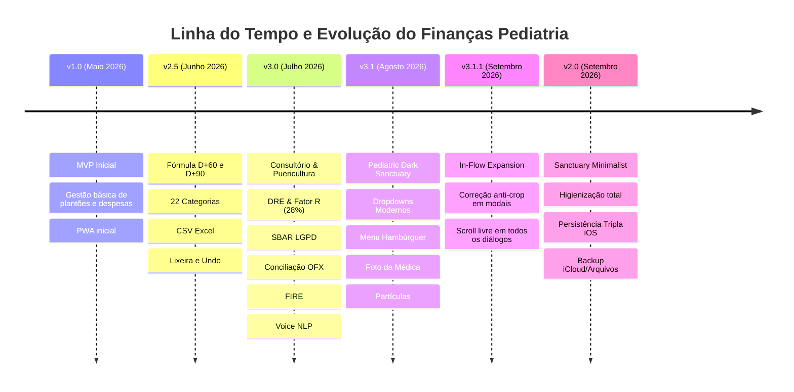

# 🗺️ ROADMAP — Finanças Pediatria

> **Visão de Produto, Marcos Históricos e Próximos Horizontes de Desenvolvimento.**  
> **Aplicação:** Finanças Pediatria (Dra. Fernanda Ch.)  
> **Autor / Criador:** **FChNeto** (`APP_CREATOR = 'FChNeto'`)  
> **Status:** Ativo / Produção Contínua  

---

## 📌 Visão de Produto & Filosofia

O **Finanças Pediatria** nasceu para resolver a complexidade financeira única vivenciada por médicas pediatras no Brasil: a convivência entre rendimentos fixos (Bolsa de Residência Médica), rendimentos variáveis com recebimento postergado e fracionado (Plantões em Sala de Parto pagos em **80% a D+60** e **20% a D+90**), despesas pessoais e de qualificação médica contínua, e a transição tributária de Pessoa Física (PF) para Pessoa Jurídica (PJ com Fator R a 28%).

O projeto equilibra duas experiências complementares:
1. **Versão v2.0 (Sanctuary Minimalist em `/v2.0/`):** Interface pura, higienizada, sem qualquer ruído visual, focada no essencial do dia a dia (Salário Residência, Plantões em Sala de Parto, 22 categorias essenciais de gastos, parcelamentos e persistência local blindada para iPhone).
2. **Versão v3.x (Master Executive na raiz `/`):** Plataforma completa com consultório de puericultura do 1º ano de vida, DRE contábil, otimizador de Fator R, passagem de plantão SBAR (LGPD), conciliação bancária OFX/CSV e simulador FIRE.

---

## 🏆 Marcos Concluídos (Histórico de Releases)



### Detalhamento dos Marcos Entregues:
- **v1.0.0 — Fundação do Core:** SPA Mobile-First para iPhone, calendário financeiro e cálculo preliminar de atrasos em plantões.
- **v2.5.0 — Regra Médica Canônica:** Implementação da fórmula de recebimento (80% D+60 e 20% D+90), categorias personalizadas e lixeira com recuperação em 1 toque.
- **v3.0.0 — Ultra Release Clínico & Executivo:**
  - Módulo nativo de Consultório e Puericultura do 1º ano (RN, 2m, 4m, 6m, 9m, 12m).
  - DRE Médica e Otimizador Dinâmico do Fator R (28%) para Anexo III do Simples Nacional.
  - Handoff clínico estruturado SBAR com anonimização LGPD para WhatsApp.
  - Parser de extratos bancários (OFX e CSV) para conciliação bancária em 1 toque.
  - Simulador FIRE da médica pediatra (meta de independência e termômetro de plantões).
  - Lançamento por comando de voz com processamento de linguagem natural (NLP).
- **v3.1.0 — Pediatric Dark Sanctuary & Ergonomia Stitch:**
  - Modo escuro repensado em tons de ameixa e vinho profundo (`#150D1C`) com texto *Lavender Blush* de altíssimo contraste.
  - Dropdowns arredondados modernos (`rounded-2xl`) com chevrons pediátricos.
  - Menu hambúrguer lateral despoluindo o topo da aplicação.
  - Upload de foto de perfil da médica com recorte e compressão local.
- **v3.1.1 — Arquitetura Anti-Crop & Modal Scroll Safeguards:**
  - Solução *In-Flow Expansion* para seletores dentro de modais, garantindo rolagem fluida e impedindo qualquer corte em telas pequenas de celular.
- **v2.0.0 — Sanctuary Minimalist (Versão Higienizada e Pura):**
  - Pasta dedicada `/v2.0/` com arquitetura independente.
  - 3 abas essenciais (Início, Ganhos, Despesas) + botão flutuante central (+).
  - Pré-configuração estrita das 22 categorias prioritárias de gastos.
  - Cálculo automático de compras parceladas com projeção mensal futura.
  - Persistência tripla no iOS (IndexedDB + LocalStorage + `navigator.storage.persist()`) e botão "Salvar no Meu iPhone" (iCloud / Arquivos via Web Share API nativa).

---

## 🚀 Próximos Horizontes & Roadmap Futuro

```
+--------------------------------------------------------------------------+
|                        HORIZONTES DE DESENVOLVIMENTO                     |
+--------------------------------------------------------------------------+
|  Q4 2026: Biometria, OCR Inteligente & Atalhos iOS                      |
|  Q1 2027: Integração WhatsApp/Telegram & Múltiplas Unidades             |
|  Q2 2027: Copiloto de IA Pediátrica & Sincronização Nuvem E2E           |
+--------------------------------------------------------------------------+
```

### 🎯 Fase 1 — Curto Prazo (Q4 2026 / v2.1 & v3.2)
- [ ] **Autenticação Biométrica Local (Face ID / Touch ID):**
  - Implementação via `WebAuthn API` para desbloqueio seguro do aplicativo ao abrir no iPhone, sem senhas.
- [ ] **Scanner Inteligente de Recibos & Notas Fiscais (OCR Local):**
  - Reconhecimento óptico de caracteres via WebAssembly (`Tesseract.js`) diretamente no navegador da médica (sem envio de fotos para servidores externos).
  - Leitura automática de comprovantes de farmácia, supermercado, cursos e congressos com autopreenchimento de valor, data e categoria.
- [ ] **Suporte a Atalhos Rápidos da Siri / Apple Shortcuts:**
  - Configuração de URL Schemes para permitir adicionar plantões ou despesas via Siri ("E aí Siri, anotar plantão de 12 horas").
- [ ] **Simulador de Férias e Décimo Terceiro da Pediatra:**
  - Cálculo de provisão mensal para remunerar o próprio descanso da médica (já que plantões não possuem férias nem 13º celetistas).

---

### 🏥 Fase 2 — Médio Prazo (Q1 2027 / v2.2 & v4.0)
- [ ] **Bot Assistente no WhatsApp / Telegram:**
  - Canal direto onde a médica envia áudios curtos ou mensagens de texto enquanto sai do hospital (ex: *"Acabei de fazer plantão de 24h na Maternidade Araken, líquido 2.800"*), registrando automaticamente via webhook criptografado.
- [ ] **Gestão Multi-Hospital & Benchmark de Rendimento por Hora:**
  - Relatório visual comparativo demonstrando qual escala ou hospital oferece a melhor remuneração líquida real por hora trabalhada, pontualidade de pagamento e índice de esforço.
- [ ] **Emissor de Recibos para Reembolso de Convênio:**
  - Geração de recibos em PDF médico padronizados com CRM, RQE, CPF e dados do paciente de puericultura para que os pais peçam reembolso no convênio de saúde (Bradesco, SulAmérica, Unimed, Amil).
- [ ] **Planejador de Metas de Equipamentos e Consultório:**
  - Cofrinhos digitais com progresso visual para compra de otoscópio de fibra óptica, estadiômetro portátil, oxímetro neonatal ou reforma da sala de atendimento.

---

### 🧠 Fase 3 — Longo Prazo (Q2 2027+ / v4.5+)
- [ ] **Copiloto Financeiro de Inteligência Artificial para Pediatras:**
  - Insights proativos com modelos de linguagem locais ou via Gemini API (ex: *"Atenção: seus gastos com alimentação aumentaram 22% durante as semanas de plantões noturnos; recomendamos preparar marmitas leves"*).
  - Alerta preventivo de estouro de alíquota do Simples Nacional ou risco de desenquadramento do Fator R no mês seguinte.
- [ ] **Sincronização Nuvem Multi-Dispositivo com Criptografia Ponta a Ponta (E2EE):**
  - Sincronização opcional entre iPhone, iPad e MacBook através de WebCrypto e armazenamento em nuvem com chave privada exclusiva em posse da médica.
- [ ] **Módulo Planejador de Maternidade / Licença-Maternidade Médica:**
  - Calculador de colchão financeiro e fluxo de caixa seguro para período de gestação e primeiros meses do bebê, considerando a suspensão temporária dos plantões.

---

## 📐 Critérios de Priorização de Demandas

Para garantir a higienização e o propósito essencial do app, qualquer nova funcionalidade deve obedecer ao seguinte crivo:
1. **Privacidade e LGPD:** Funciona 100% no cliente sem vazar dados sensíveis de pacientes ou da médica?
2. **Ergonomia no Plantão:** A médica consegue lançar com 1 mão, cansada, em menos de 10 segundos?
3. **Não-Poluição Visual:** A tela permanece limpa, acolhedora e desobstruída?
4. **Resiliência a Falhas:** Funciona offline dentro de UTIs com paredes de chumbo e sem sinal 4G/5G?
5. **Aprovação em Testes:** Possui testes automatizados com cobertura matemática rigorosa?

---

*Finanças Pediatria — O santuário financeiro e tecnológico da médica pediatra.* 🌸🩺  
*Criado por FChNeto.*
