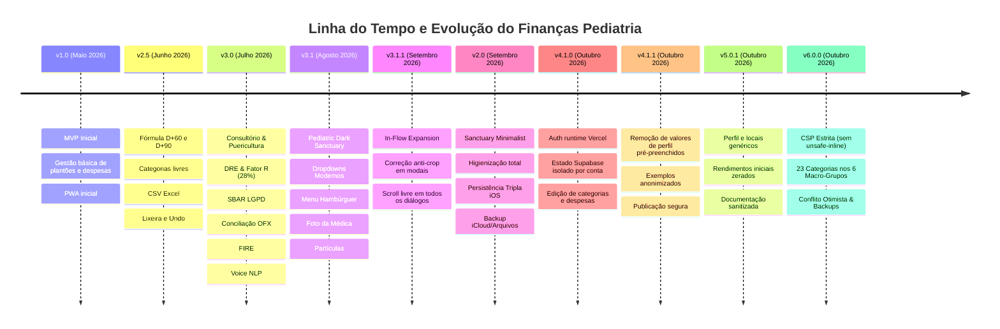

# 🗺️ ROADMAP — Finanças Pediatria

> **Visão de Produto, Marcos Históricos e Próximos Horizontes de Desenvolvimento.**  
> **Aplicação:** Finanças Pediatria
> **Autor / Criador:** **FChNeto** (`APP_CREATOR = 'FChNeto'`)  
> **Status:** Ativo / Produção Contínua  

---

## 📌 Visão de Produto & Filosofia

O **Finanças Pediatria** organiza rendimentos fixos configuráveis, receitas variáveis com recebimento postergado e fracionado (regra padrão de **75% em D+60** e **25% em D+90**), despesas e parâmetros tributários informados pela pessoa usuária.

O projeto equilibra experiências complementares:
1. **Versão v6.0.0 (Cloud & Sanctuary em `/v6/`):** Versão oficial com autenticação Supabase, CSP estrita sem `unsafe-inline`, 23 categorias canônicas mapeadas nos 6 macro-grupos, detecção de concorrência com bloqueio otimista e backups de conflito.
2. **Versão v2.0 (Sanctuary Minimalist em `/v2.0/`):** Interface pura, higienizada, sem ruído visual, focada em receitas, despesas, categorias, parcelamentos e persistência local.
3. **Versões v5.x (`/` e `/v5/`):** Aplicação standalone com painel financeiro, categorias editáveis e experiência mobile-first.
4. **Versão v4.1.1 (`/V4_Cloud/`):** Aplicação Cloud com autenticação Supabase, sincronização por conta e edição de categorias e despesas.
5. **Versões v3.x (histórico):** Consultório, DRE, Fator R, SBAR, conciliação bancária, simulador FIRE e entrada por voz.

---

## 🏆 Marcos Concluídos (Histórico de Releases)


```mermaid
timeline
    title Linha do Tempo e Evolução do Finanças Pediatria
    v1.0 (Maio 2026) : MVP Inicial : Gestão básica de plantões e despesas : PWA inicial
    v2.5 (Junho 2026) : Fórmula D+60 e D+90 : Categorias livres : CSV Excel : Lixeira e Undo
    v3.0 (Julho 2026) : Consultório & Puericultura : DRE & Fator R (28%) : SBAR LGPD : Conciliação OFX : FIRE : Voice NLP
    v3.1 (Agosto 2026) : Pediatric Dark Sanctuary : Dropdowns Modernos : Menu Hambúrguer : Foto da Médica : Partículas
    v3.1.1 (Setembro 2026) : In-Flow Expansion : Correção anti-crop em modais : Scroll livre em todos os diálogos
    v2.0 (Setembro 2026) : Sanctuary Minimalist : Higienização total : Persistência Tripla iOS : Backup iCloud/Arquivos
    v4.1.0 (Outubro 2026) : Auth runtime Vercel : Estado Supabase isolado por conta : Edição de categorias e despesas
    v4.1.1 (Outubro 2026) : Remoção de valores de perfil pré-preenchidos : Exemplos anonimizados : Publicação segura
    v5.0.1 (Outubro 2026) : Perfil e locais genéricos : Rendimentos iniciais zerados : Documentação sanitizada
    v6.0.0 (Outubro 2026) : CSP Estrita (sem unsafe-inline) : 23 Categorias nos 6 Macro-Grupos : Conflito Otimista & Backups
```

### Detalhamento dos Marcos Entregues:
- **v1.0.0 — Fundação do Core:** SPA Mobile-First para iPhone, calendário financeiro e cálculo preliminar de atrasos em plantões.
- **v2.5.0 — Regra Médica Canônica:** Implementação da fórmula de recebimento D+60/D+90, categorias personalizadas e lixeira com recuperação em 1 toque.
- **v3.0.0 — Ultra Release Clínico & Executivo:**
  - Módulo nativo de Consultório e Puericultura do 1º ano (RN, 2m, 4m, 6m, 9m, 12m).
  - DRE Médica e Otimizador Dinâmico do Fator R (28%) para Anexo III do Simples Nacional.
  - Handoff clínico estruturado SBAR com anonimização LGPD para WhatsApp.
  - Parser de extratos bancários (OFX e CSV) para conciliação bancária em 1 toque.
  - Simulador FIRE da médica pediatra (meta de independência e termômetro de plantões).
  - Lançamento por comando de voz com processamento de linguagem natural (NLP).
- **v3.1.0 — Pediatric Dark Sanctuary & Ergonomia Stitch:**
  - Modo escuro repensado em tons de ameixa e vinho profundo (`#150D1C`) com texto *Lavender Blush* de altíssimo contraste.
  - Dropdowns arredondados modernos (`rounded-2xl`) com chevrons pediátricos.
  - Menu hambúrguer lateral despoluindo o topo da aplicação.
  - Upload de foto de perfil da médica com recorte e compressão local.
- **v3.1.1 — Arquitetura Anti-Crop & Modal Scroll Safeguards:**
  - Solução *In-Flow Expansion* para seletores dentro de modais, garantindo rolagem fluida e impedindo qualquer corte em telas pequenas de celular.
- **v2.0.0 — Sanctuary Minimalist (Versão Higienizada e Pura):**
  - Pasta dedicada `/v2.0/` com arquitetura independente.
  - 3 abas essenciais (Início, Ganhos, Despesas) + botão flutuante central (+).
  - Pré-configuração estrita das categorias prioritárias listadas em `agents.md`.
  - Cálculo automático de compras parceladas com projeção mensal futura.
  - Persistência tripla no iOS (IndexedDB + LocalStorage + `navigator.storage.persist()`) e botão "Salvar no Meu iPhone" (iCloud / Arquivos via Web Share API nativa).

- **V4_Cloud v4.1.0 — Correção de autenticação e sincronização por conta:**
  - Configuração pública do Supabase carregada em runtime pela Vercel, sem credenciais embutidas no HTML.
  - Callback OAuth sem troca duplicada do código PKCE; cadastro por senha encaminha o retorno à origem atual.
  - Estado completo persistido por usuário com RLS e controle de revisão para evitar sobrescrita silenciosa entre dispositivos.
  - Escopo local isolado por conta, edição de despesas e renomeação de categorias com atualização dos lançamentos relacionados.
  - Revalidação de HTML, CSS e JavaScript para reduzir a entrega de versões antigas após deploy.

- **V4_Cloud v4.1.1 — Privacidade dos padrões:** remoção de nomes, locais, registros profissionais e valores financeiros pré-preenchidos; novos perfis começam sem renda configurada.
- **Standalone v5.0.1 — Privacidade dos dados iniciais:** perfis e locais sem identificação, renda inicial zerada, protótipos sem saldos demonstrativos e documentos operacionais atualizados.

## 🔎 Plano de Revisão e Gestão Operacional

1. **Autenticação e implantação:** conferir Vercel Root Directory, variáveis públicas, provedor Google, URL de callback do Supabase e allowlist de retorno; exercitar cadastro com confirmação de e-mail e login em sessão nova.
2. **Dados e isolamento:** aplicar as migrações em ordem, conferir RLS para cada usuário e testar leitura, criação, atualização, conflito entre dispositivos e restauração de backup.
3. **Financeiro:** revisar arredondamentos, fechamento de mês D+60/D+90, parcelamentos, edição de lançamentos e classificação em grupos macro.
4. **Interface móvel:** validar iPhone/Safari, teclado, áreas seguras, estados sem internet, acessibilidade, formulários e menus dentro de modais.
5. **Regressão e liberação:** executar as suítes da raiz, v2, v4 e V4_Cloud; depois publicar primeiro em preview e validar com conta de teste antes de trocar o domínio de produção.

**Acompanhamento pendente:** o código não consegue habilitar credenciais Google, redirects ou variáveis nos painéis externos. Esses itens estão descritos em `V4_Cloud/README.md`.

---

## 🚀 Próximos Horizontes & Roadmap Futuro

```
+--------------------------------------------------------------------------+
|                        HORIZONTES DE DESENVOLVIMENTO                     |
+--------------------------------------------------------------------------+
|  Q4 2026: Biometria, OCR Inteligente & Atalhos iOS                      |
|  Q1 2027: Integração WhatsApp/Telegram & Múltiplas Unidades             |
|  Q2 2027: Copiloto de IA Pediátrica & Sincronização Nuvem E2E           |
+--------------------------------------------------------------------------+
```

### 🎯 Fase 1 — Curto Prazo (Q4 2026 / v2.1 & v3.2)
- [ ] **Autenticação Biométrica Local (Face ID / Touch ID):**
  - Implementação via `WebAuthn API` para desbloqueio seguro do aplicativo ao abrir no iPhone, sem senhas.
- [ ] **Scanner Inteligente de Recibos & Notas Fiscais (OCR Local):**
  - Reconhecimento óptico de caracteres via WebAssembly (`Tesseract.js`) diretamente no navegador da médica (sem envio de fotos para servidores externos).
  - Leitura automática de comprovantes de farmácia, supermercado, cursos e congressos com autopreenchimento de valor, data e categoria.
- [ ] **Suporte a Atalhos Rápidos da Siri / Apple Shortcuts:**
  - Configuração de URL Schemes para permitir adicionar plantões ou despesas via Siri ("E aí Siri, anotar plantão de 12 horas").
- [ ] **Simulador de Férias e Décimo Terceiro da Pediatra:**
  - Cálculo de provisão mensal para remunerar o próprio descanso da médica (já que plantões não possuem férias nem 13º celetistas).

---

### 🏥 Fase 2 — Médio Prazo (Q1 2027 / v2.2 & v4.0)
- [ ] **Bot Assistente no WhatsApp / Telegram:**
  - Canal direto para registrar lançamentos por áudio ou texto, usando os valores e locais informados pela pessoa usuária.
- [ ] **Gestão de Locais de Atendimento & Benchmark de Rendimento por Hora:**
  - Relatório visual comparativo das remunerações por hora e prazos de pagamento dos locais configurados pela pessoa usuária.
- [ ] **Emissor de Recibos para Reembolso de Convênio:**
  - Geração de recibos padronizados com os campos cadastrais necessários, sem incluir dados de demonstração identificáveis.
- [ ] **Planejador de Metas de Equipamentos e Consultório:**
  - Cofrinhos digitais com progresso visual para compra de otoscópio de fibra óptica, estadiômetro portátil, oxímetro neonatal ou reforma da sala de atendimento.

---

### 🧠 Fase 3 — Longo Prazo (Q2 2027+ / v4.5+)
- [ ] **Copiloto Financeiro de Inteligência Artificial para Pediatras:**
  - Insights proativos com modelos de linguagem locais ou via Gemini API (ex: *"Atenção: seus gastos com alimentação aumentaram 22% durante as semanas de plantões noturnos; recomendamos preparar marmitas leves"*).
  - Alerta preventivo de estouro de alíquota do Simples Nacional ou risco de desenquadramento do Fator R no mês seguinte.
- [ ] **Sincronização Nuvem Multi-Dispositivo com Criptografia Ponta a Ponta (E2EE):**
  - Sincronização opcional entre iPhone, iPad e MacBook através de WebCrypto e armazenamento em nuvem com chave privada exclusiva em posse da médica.
- [ ] **Módulo Planejador de Maternidade / Licença-Maternidade Médica:**
  - Calculador de colchão financeiro e fluxo de caixa seguro para período de gestação e primeiros meses do bebê, considerando a suspensão temporária dos plantões.

---

## 📐 Critérios de Priorização de Demandas

Para garantir a higienização e o propósito essencial do app, qualquer nova funcionalidade deve obedecer ao seguinte crivo:
1. **Privacidade e LGPD:** Funciona 100% no cliente sem vazar dados sensíveis de pacientes ou da médica?
2. **Ergonomia no Plantão:** A médica consegue lançar com 1 mão, cansada, em menos de 10 segundos?
3. **Não-Poluição Visual:** A tela permanece limpa, acolhedora e desobstruída?
4. **Resiliência a Falhas:** Funciona offline dentro de UTIs com paredes de chumbo e sem sinal 4G/5G?
5. **Aprovação em Testes:** Possui testes automatizados com cobertura matemática rigorosa?

---

*Finanças Pediatria — O santuário financeiro e tecnológico da médica pediatra.* 🌸🩺  
*Criado por FChNeto.*
